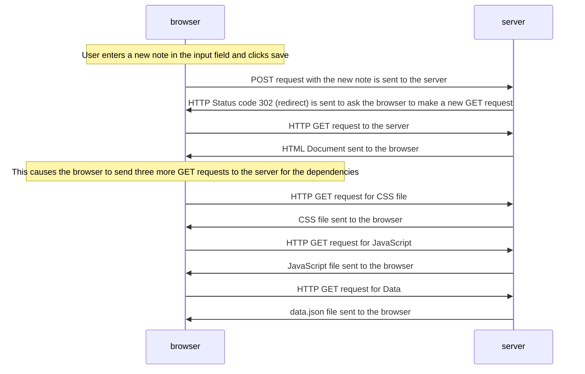

### New Note Diagram
Diagram created with the mermaid syntax depicts a situation a user creates a new note on the page https://studies.cs.helsinki.fi/exampleapp/notes
# Sequence Diagram Example

```mermaid
sequenceDiagram
    participant browser
    participant server

    Note over browser: User enters a new note in the input field and clicks save
    browser ->> server: POST request with the new note is sent to the server
    server ->> browser: HTTP Status code 302 (redirect) is sent to ask the browser to make a new GET request
    browser ->> server: HTTP GET request to the server
    server ->> browser: HTML Document sent to the browser
    
    Note over browser: This causes the browser to send three more GET requests to the server for the dependencies
    browser ->> server: HTTP GET request for CSS file
    server ->> browser: CSS file sent to the browser
    browser ->> server: HTTP GET request for JavaScript
    server ->> browser: JavaScript file sent to the browser
    browser ->> server: HTTP GET request for Data
    server ->> browser: data.json file sent to the browser
```
